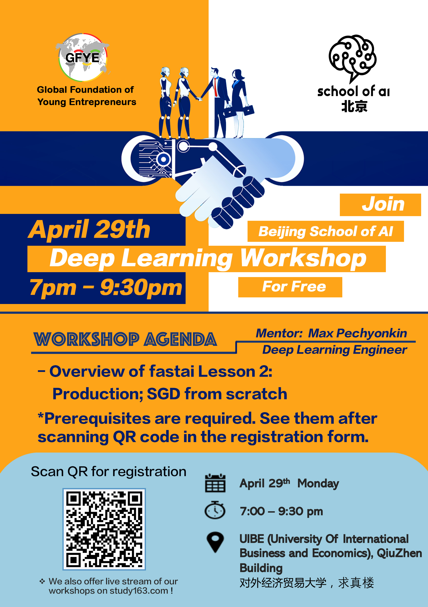

# The School of AI Beijing
- Welcome to Beijing [School of AI](https://www.theschool.ai/) !

## 目录
- [关于SoAI](#关于soai)
- [资料](#资料)
   - [SoAI北京](#soai-北京)
   - [Github代码库](#git代码库)
- [课程列表](#课程列表)
- [课程内容](#课程内容)
   - [第一课 深度学习入门指南](#第一课-深度学习入门指南)
   - [第二课 图像分类](#第二课-图像分类)
- [作业汇总](#作业汇总)
- [参考资料](#参考资料)
- [交流分享](#交流分享)

---

## 关于SoAI
- An international educational non-profit platform dedicated to studying, teaching and creating AI to help solve the world’s most difficult problems. Our mission is to offer a world-class AI education to anyone on Earth for free.   
- 北京分部有中文、英文两个版本，详情：
   - 英语分支，每周一晚在朝阳，Max主讲 
   - 中文分支，每周末下午17:00，清华大学，海淀区双清路双清大厦4号楼4层清华数据科学研究院，王奇文等主讲，采用翻转课堂方式
,

## 资料

### SoAI-北京
- 网易课堂直播：[BEIJING SCHOOL OF AI WORKSHOP](https://study.163.com/course/courseMain.htm?courseId=1209149803)

### Git代码库
- 克隆代码库到本地:
> git clone git@github.com:wqw547243068/school-of-ai-beijing.git

### 入门必读
- 机器学习入门：
   - [可视化讲解机器学习](http://www.r2d3.us/%E5%9B%BE%E8%A7%A3%E6%9C%BA%E5%99%A8%E5%AD%A6%E4%B9%A0/)
- 深度学习入门：
   - 布朗学院新鲜出炉，[交互式图解人工智能](https://okai.brown.edu/zh/index.html)
   - [Google PlayGround神经网络训练在线演示](http://playground.tensorflow.org/#activation=tanh&batchSize=10&dataset=circle&regDataset=reg-plane&learningRate=0.03&regularizationRate=0&noise=0&networkShape=4,2&seed=0.45786&showTestData=false&discretize=false&percTrainData=50&x=true&y=true&xTimesY=false&xSquared=false&ySquared=false&cosX=false&sinX=false&cosY=false&sinY=false&collectStats=false&problem=classification&initZero=false&hideText=false),[汉化版](http://playground.tensorflowjiaocheng.com/)，[手写数字识别3D交互体验](http://scs.ryerson.ca/~aharley/vis/conv/)

## 课程列表

时间线：
|*时间*|*章节*|*题目*|*作业*|*备注*|
|----|----|:------:|:----|:----|
|2019-04-21|介绍|深度学习入门指南|请完成ppt里提到的作业，长期|这节课长达2h，内容非常多|
|2018-04-27|第一课|宠物图片分类,[英文视频](https://course.fast.ai/videos/?lesson=1),[中文版笔记](https://forums.fast.ai/t/fast-ai-v3-2019/39325/74?u=daniel)|请提前预习|安装fastai环境并动手实现|
|2018-05-* |第二课|特征工程及SGD,[英文视频](https://course.fast.ai/videos/?lesson=2),[中文版笔记](https://forums.fast.ai/t/fast-ai-v3-2019/39325/79?u=daniel)||-|
|2018-05-* |第三课|多标签分类,[英文视频](https://course.fast.ai/videos/?lesson=3),[中文版笔记](https://forums.fast.ai/t/fast-ai-v3-2019/39325/78?u=daniel)||-|
|2018-05-* |第四课|NLP&推荐系统,[英文视频](https://course.fast.ai/videos/?lesson=4),[中文版笔记](https://forums.fast.ai/t/fast-ai-v3-2019/39325/77?u=daniel)||-|
|2018-05-* |第五课|从反向传播到神经网络,[英文视频](https://course.fast.ai/videos/?lesson=5),[中文版笔记](https://forums.fast.ai/t/fast-ai-v3-2019/39325/72?u=daniel)||-|
|2018-05-* |第六课|正则化卷积,[英文视频](https://course.fast.ai/videos/?lesson=6),[中文版笔记](https://forums.fast.ai/t/fast-ai-v3-2019/39325/71?u=daniel)||-|
|2018-05-* |第七课|Resnets、GAN等,[英文视频](https://course.fast.ai/videos/?lesson=7),[中文版笔记](https://forums.fast.ai/t/fast-ai-v3-2019/39325/69?u=daniel)||-|
| -|-|-|-|-|-|

最新课程安排见[project区](https://github.com/wqw547243068/school-of-ai-beijing/projects/1)，[Fastai中文笔记](https://forums.fast.ai/t/fast-ai-v3-2019/39325)

## 课程内容
- 本教程以[fastai的速成课](https://course.fast.ai/videos/?lesson=1)为蓝本

### 第一课 深度学习入门指南

### 第二课 图像分类
- 主题：fastai课程的第一课进行讨论：图像分类。
- 时间：于4月27日星期日下午5点举行
- 地点：双清路77号院双清大厦4号楼4层清华数据科学研究院

议程：
- 简要介绍fastai第1课的所有必要资源：图像分类。如何获取fastai的资源。 30分钟。我们将确保每个人都了解课程结构和官方资源。关于中国云GPU的讨论。
- 6名学生（或更少）将现场演示他们的第一课作业。（每位演讲人10分钟）。 1小时或更短时间。
- 自由问答。完成第一课的学生将与第一课中遇到困难的学生合作。30分钟

资料：
- 第1课的官方视频：图像分类：https://course.fast.ai/videos/?lesson=1
- 带有英文字幕的第1课视频（无需vpn）：https://www.bilibili.com/video/av41718196?from=search&seid=15198798356009994731
- 官方资源和第1课的更新：https://forums.fast.ai/t/lesson-1-official-resources-and-updates/27936
- AI北京学习集团官方论坛：https://forums.fast.ai/t/school-of-ai-beijing-study-group/43436。
- 视频详细说明：https://github.com/hiromis/notes/blob/master/Lesson1.md
- 主代码库：https://github.com/fastai/course-v3
- 主要网站：https://course.fast.ai/
- 主要论坛（需要个人注册）：https://forums.fast.ai/

PS：即使不太了解Python，您也可以运行第1课中的所有代码行，这将激励你去研究细节。 （最终你需要了解自行车的机械才能够骑它吗？）。如果您在某个问题上确实无法解决，欢迎您在微信组或以下网址提出任何问题：https://forums.fast.ai/t/school-of-ai-beijing-study-group/43436

## 作业汇总
- [Homework](homework/README.md)
- 分线上和线下渠道，将自己的作业整理到github或colab，去project[作业汇总区](https://github.com/wqw547243068/school-of-ai-beijing/projects/2)新建自己的卡片

## 参考资料
###  CNN和CV
1. iris数据集+机器学习实战
1. CNN简介
   - 计算机视觉
      - [YJango的卷积神经网络——介绍](https://zhuanlan.zhihu.com/p/27642620),[SIFT与HOG特征提取](http://blog.csdn.net/taigw/article/details/42206311)
      - [李飞飞《让冰冷的机器读懂照片背后的故事》](http://www.ifanr.com/648667),[TED视频《我们怎样教计算机理解图片》](https://www.ted.com/talks/fei_fei_li_how_we_re_teaching_computers_to_understand_pictures?language=zh-cn),[网易公开课：《李飞飞：如何教计算机理解图片》](http://open.163.com/movie/2015/3/Q/R/MAKN9A24M_MAKN9QAQR.html)
   - CNN基本结构
      - 《神经网络与深度学习》吴岸城,[Deep Learning（深度学习）学习笔记整理系列之（一）](http://blog.csdn.net/zouxy09/article/details/8775360),[Andrew Ng 深度学习(Deep Learning)介绍](http://blog.sina.com.cn/s/blog_50a5cf290101r7a6.html)
      - [YJango的卷积神经网络——介绍](https://zhuanlan.zhihu.com/p/27642620),[卷积神经网络工作原理直观的解释？](https://www.zhihu.com/question/39022858)
      - [Yann LeCun连发三弹：人人都懂的深度学习基本原理（附视频）](https://www.leiphone.com/news/201612/Sjkmer9Kto5ILxFk.html?utm_source=itdadao&utm_medium=referral)
      - [卷积神经网络中用1*1 卷积有什么作用或者好处呢？](https://www.zhihu.com/question/56024942)
      - 手写数字识别[3D交互体验](http://scs.ryerson.ca/~aharley/vis/conv/)
      - [CNN发展历史](http://www.cnblogs.com/52machinelearning/p/5821591.html),[台大李宏毅：一天搞懂深度学习](http://v.youku.com/v_show/id_XMTY5NDUzNjIxNg==.html?from=s1.8-1-1.2&spm=0.0.0.0.LZsB12%EF%BC%8C%E4%B8%80%E5%A4%A9%E6%90%9E%E6%87%82%E6%B7%B1%E5%BA%A6%E5%AD%B8%E7%BF%92--%E5%AD%B8%E7%BF%92%E5%BF%83%E5%BE%97)

1. 应用
   - 目标检测,作业：[Tensorflow lite在移动设备上的运行Demo](https://blog.csdn.net/masa_fish/article/details/54097796)
   - 人脸识别,作业：[python的人脸识别工具包face recognition](https://github.com/ageitgey/face_recognition)
   - 参考资料：[Large Pose 3D Face Reconstruction from a Single Image via Direct Volumetric CNN Regression](http://aaronsplace.co.uk/papers/jackson2017recon/),[2D图像三维重建Demo体验地址](http://www.cs.nott.ac.uk/~psxasj/3dme/view.php?name=../59b415560b915),[表情替换，DeepWarp Demo Page](http://163.172.78.19/)
   - 颜值预测，[一个基于 TensorFlow 的「颜值评分」开源项目：FaceRank](https://zhuanlan.zhihu.com/p/28208481)
1. 反思
   - [Geoffrey Hinton多伦多大学演讲：卷积神经网络的问题](http://www.sohu.com/a/165989490_465975)
   - [Hinton的Capsule论文全公开！首发《胶囊间的动态路由》原文精译，了解Hinton的胶囊网络ㅣ第一部分：直觉](http://mp.weixin.qq.com/s/gAFKrUjfQyqaDKNyMRitZg)

## 交流分享
欢迎大家入群分享、交流！
- QQ群

## 合作方

